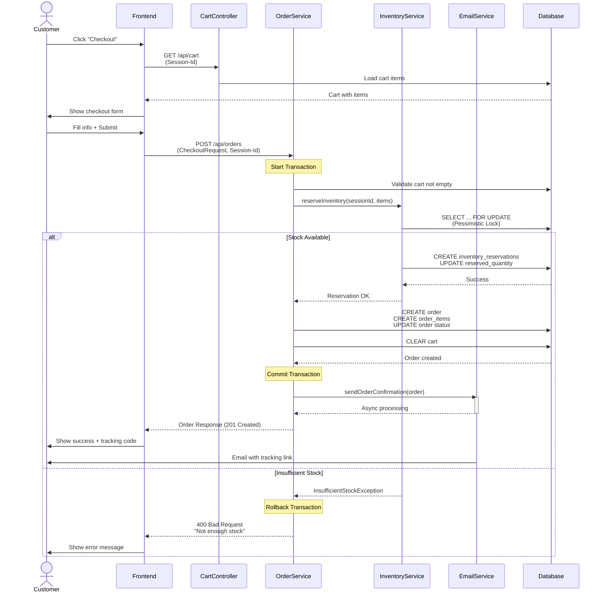
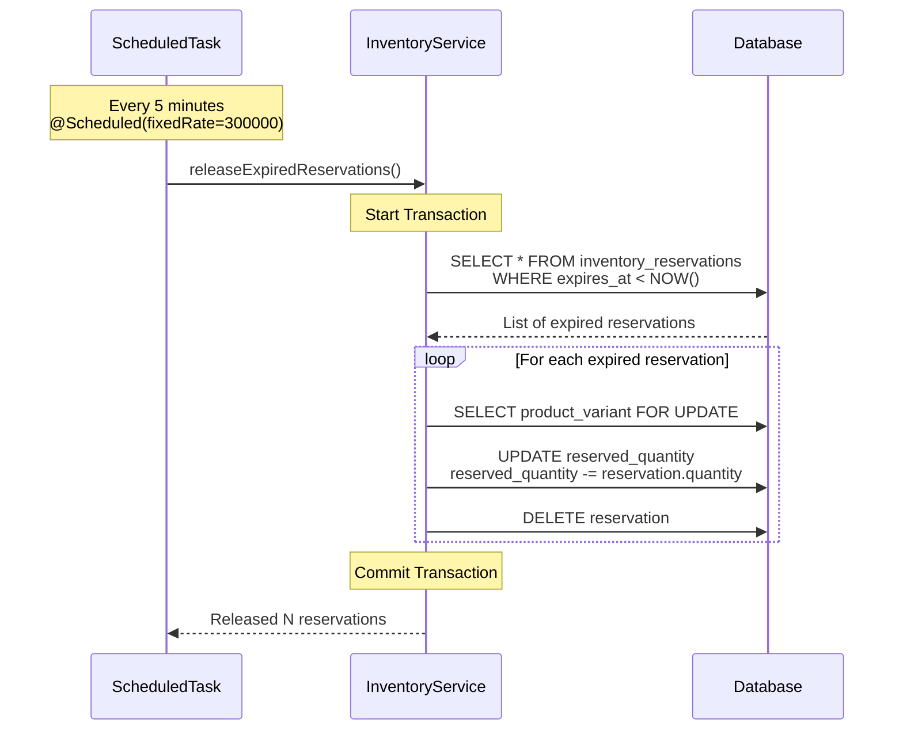
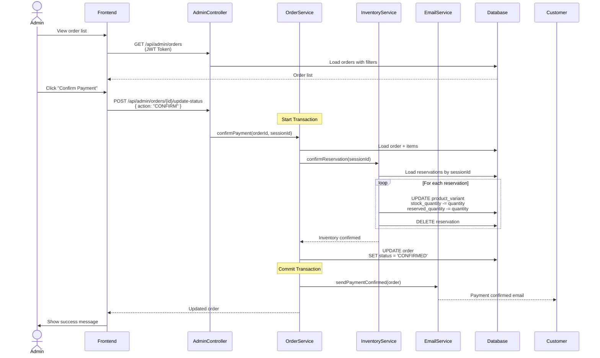
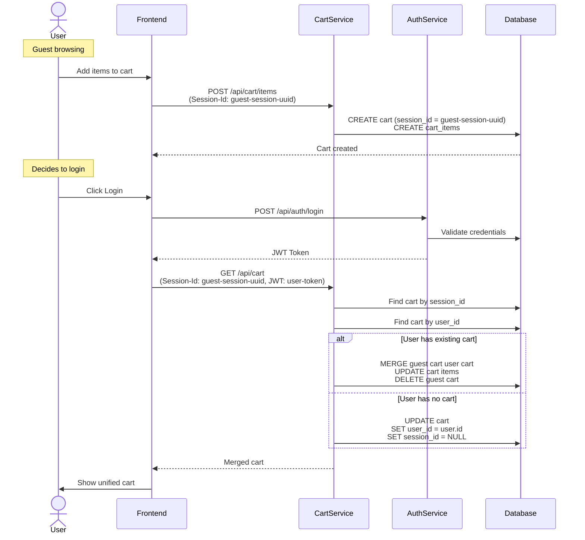

# BÁO CÁO KỸ THUẬT & GIẢI PHÁP HỆ THỐNG
## E-COMMERCE BACKEND SYSTEM - HUNG HYPEBEAST STORE
**Người thực hiện:** HaiDD69
**Khách hàng:** Anh Hùng - Founder "Hung Hypebeast"
**Thời gian thực hiện:** 2 tuần
---
## MỤC LỤC
1. [Đánh Giá Sơ Bộ & Phân Tích Yêu Cầu](#1-đánh-giá-sơ-bộ--phân-tích-yêu-cầu)
2. [Thiết Kế Hệ Thống](#2-thiết-kế-hệ-thống)
3. [Low Level Design (LLD)](#3-low-level-design-lld)
4. [Kế Hoạch Triển Khai](#4-kế-hoạch-triển-khai)
---
## 1. ĐÁNH GIÁ SƠ BỘ & PHÂN TÍCH YÊU CẦU
### 1.1. Xác Định Scope
#### **MUST-HAVE (Hoàn thiện 100%)**
Các tính năng bắt buộc phải hoàn thành trong 2 tuần:
| STT | Tính năng | Độ ưu tiên | Lý do |
|-----|-----------|------------|-------|
| 1 | **Catalog Management** | Critical | Core business - Hiển thị sản phẩm cho khách hàng |
| 1.1 | Quản lý Product & Variants (Size, Color) |  | Sản phẩm có nhiều biến thể |
| 1.2 | Phân trang & Sorting |  | Load nhanh cho danh sách sản phẩm |
| 1.3 | Filter theo giá & category |  | Tìm kiếm sản phẩm dễ dàng |
| 2 | **Shopping Cart** | Critical | Core business - Quản lý giỏ hàng |
| 2.1 | CRUD Cart Items |  | Thêm/sửa/xóa sản phẩm trong giỏ |
| 2.2 | Kiểm tra tồn kho realtime |  | Tránh bán quá số lượng |
| 3 | **Inventory Reservation** | Critical | Giải quyết vấn đề "Last Item" |
| 3.1 | Reserve stock 10-15 phút |  | Giữ hàng khi checkout |
| 3.2 | Auto-release expired reservations |  | Nhả hàng tự động |
| 3.3 | Handle concurrent requests |  | Tránh overselling |
| 4 | **Checkout & Order** | Critical | Tạo đơn hàng |
| 4.1 | COD Payment |  | Thanh toán khi nhận hàng |
| 4.2 | Tạo đơn & tracking code |  | Theo dõi đơn hàng |
| 4.3 | Email confirmation |  | Gửi email sau khi đặt hàng |
| 5 | **Order Tracking** | Critical | Khách hàng theo dõi đơn |
| 5.1 | Public tracking by code |  | Không cần đăng nhập |
| 5.2 | Email tracking link |  | Link trong email |
| 6 | **Admin Management** | Critical | Quản lý đơn hàng |
| 6.1 | Xem danh sách đơn hàng |  | Quản lý tất cả đơn |
| 6.2 | Cập nhật trạng thái đơn |  | Confirm payment, cancel |
| 6.3 | Filter đơn theo status |  | Tìm đơn nhanh |
| 7 | **Authentication** | High | Bảo mật API |
| 7.1 | JWT Authentication |  | Bảo vệ admin endpoints |
| 7.2 | Role-based access (ADMIN/CUSTOMER) |  | Phân quyền |
#### **NICE-TO-HAVE (Phase 2)**
Các tính năng để lại phase sau nếu không kịp:
| STT | Tính năng | Lý do trì hoãn |
|-----|-----------|----------------|
| 1 | **SePay Integration** | Tích hợp payment gateway mất thời gian, có thể làm giả lập webhook |
| 2 | **Product CRUD APIs** | Admin nhập liệu trực tiếp DB, chưa cần UI |
| 3 | **Advanced Search** | Full-text search, có thể dùng filter cơ bản thay thế |
| 4 | **Voucher/Discount** | Chưa urgent, Phase 1 focus core flow |
| 5 | **Review/Rating** | Không phải yêu cầu Phase 1 |
### 1.2. Gap Analysis
#### **Phân tích khoảng cách giữa yêu cầu khách hàng và thực tế kỹ thuật:**
| Yêu cầu từ Email | Yêu cầu Kỹ thuật Thực tế | Gap | Giải pháp |
|------------------|-------------------------|-----|-----------|
| "Giữ hàng 10-15 phút" | Cần inventory reservation system với distributed lock | Medium |  Implement pessimistic lock + scheduled cleanup job |
| "Tự động nhận biết thanh toán SePay" | Webhook integration + payment verification | High | ️ Phase 1: Manual confirm, Phase 2: Auto webhook |
| "Gửi email tracking" | Email service + background job | Low |  Spring Mail + async processing |
| "Không yêu cầu đăng nhập khi tracking" | Public API với security considerations | Low |  Public endpoint với tracking code làm authentication |
| "Xử lý Last Item chính xác" | Database row-level locking | Medium |  Pessimistic lock (@Lock(PESSIMISTIC_WRITE)) |
| "API tạo/sửa sản phẩm" | Full CRUD + validation | Low | ️ Phase 2, Phase 1 seed data |
### 1.3. Đánh Giá Khả Năng Hoàn Thiện
#### **Cam kết hoàn thành: 95%**
**HOÀN THÀNH 100%:**
-  Product Catalog với variants (Size, Color)
-  Shopping Cart với stock validation
-  Inventory Reservation System (10 phút)
-  Checkout với COD payment
-  Order tracking không cần login
-  Email notification system
-  Admin order management
-  JWT Authentication & Authorization
**HOÀN THÀNH 90%:**
- ️ SePay Integration: Chỉ có mock/manual confirmation (Phase 1)
  - **Lý do:** Tích hợp payment gateway cần test account, webhook setup
  - **Giải pháp:** Admin manual confirm payment, Phase 2 auto webhook
**KHÔNG HOÀN THÀNH (Phase 2):**
-  Product CRUD API cho admin
  - **Lý do:** Ưu tiên core customer flow
  - **Workaround:** Seed data via database initialization
#### **Rủi ro & Mitigation:**
| Rủi ro | Mức độ | Mitigation |
|--------|--------|------------|
| Database performance với concurrent requests | Medium | Indexing + Connection pooling + Caching |
| Email delivery failure | Low | Async processing + retry mechanism |
| Server crash  mất reservation | Medium | Scheduled cleanup job chạy mỗi 5 phút |
| Overselling trong race condition | High | Pessimistic locking + transaction isolation |
### 1.4. Technical Stack Decision
| Component | Technology | Lý do chọn |
|-----------|-----------|-----------|
| **Backend Framework** | Spring Boot 4.0.1 | Mature, production-ready, rich ecosystem |
| **Language** | Java 21 | Latest LTS, performance improvements |
| **Database** | PostgreSQL | ACID compliance, advanced locking |
| **ORM** | Spring Data JPA + Hibernate | Productivity, entity management |
| **Authentication** | JWT (jjwt) | Stateless, scalable |
| **Email** | Spring Mail (SMTP) | Simple, reliable |
| **Caching** | Caffeine | High performance in-memory cache |
| **Documentation** | SpringDoc OpenAPI 3 | Auto-generate Swagger UI |
| **Build Tool** | Maven | Standard, dependency management |
---
## 2. THIẾT KẾ HỆ THỐNG
### 2.1. Database Design (ERD)

```dbdiagram
Table users {
  id UUID [pk]
  email VARCHAR(100) [unique, not null]
  password VARCHAR [not null]
  full_name VARCHAR(100) [not null]
  phone VARCHAR(20)
  role VARCHAR [not null] // ADMIN, CUSTOMER
  active BOOLEAN [not null, default: true]
  created_at TIMESTAMP [not null]
  updated_at TIMESTAMP [not null]
  Indexes {
    email [name: 'idx_user_email']
    active [name: 'idx_user_active']
  }
}
Table categories {
  id UUID [pk]
  name VARCHAR(100) [unique, not null]
  description TEXT
  active BOOLEAN [not null, default: true]
  created_at TIMESTAMP [not null]
  updated_at TIMESTAMP [not null]
  Indexes {
    active [name: 'idx_category_active']
  }
}
Table products {
  id UUID [pk]
  name VARCHAR [not null]
  description TEXT
  category_id UUID [ref: > categories.id, not null]
  base_price DECIMAL(10,2) [not null]
  image_url VARCHAR
  active BOOLEAN [not null, default: true]
  created_at TIMESTAMP [not null]
  updated_at TIMESTAMP [not null]
  Indexes {
    category_id [name: 'idx_product_category']
    active [name: 'idx_product_active']
    name [name: 'idx_product_name']
  }
}
Table product_variants {
  id UUID [pk]
  product_id UUID [ref: > products.id, not null]
  sku VARCHAR [unique, not null]
  size VARCHAR // M, L, XL, XXL, null (nếu không có size)
  color VARCHAR [not null] // BLACK, WHITE, RED, BLUE
  price DECIMAL(10,2) [not null]
  stock_quantity INTEGER [not null, default: 0]
  reserved_quantity INTEGER [not null, default: 0]
  active BOOLEAN [not null, default: true]
  created_at TIMESTAMP [not null]
  updated_at TIMESTAMP [not null]
  Indexes {
    (product_id, size, color) [unique, name: 'uk_variant']
    sku [unique, name: 'idx_variant_sku']
  }
}
Table carts {
  id UUID [pk]
  session_id VARCHAR [unique]
  user_id UUID [ref: > users.id]
  created_at TIMESTAMP [not null]
  updated_at TIMESTAMP [not null]
  Note: 'Support both guest (session_id) and authenticated users (user_id)'
}
Table cart_items {
  id UUID [pk]
  cart_id UUID [ref: > carts.id, not null]
  product_variant_id UUID [ref: > product_variants.id, not null]
  quantity INTEGER [not null]
  created_at TIMESTAMP [not null]
  updated_at TIMESTAMP [not null]
}
Table inventory_reservations {
  id UUID [pk]
  session_id VARCHAR [not null]
  product_variant_id UUID [ref: > product_variants.id, not null]
  quantity INTEGER [not null]
  expires_at TIMESTAMP [not null]
  created_at TIMESTAMP [not null]
  updated_at TIMESTAMP [not null]
  Indexes {
    session_id [name: 'idx_reservation_session']
    expires_at [name: 'idx_reservation_expires']
  }
}
Table orders {
  id UUID [pk]
  order_number VARCHAR [unique, not null]
  tracking_code VARCHAR [unique, not null]
  session_id VARCHAR
  user_id UUID [ref: > users.id]
  customer_name VARCHAR [not null]
  customer_email VARCHAR [not null]
  customer_phone VARCHAR [not null]
  shipping_address VARCHAR [not null]
  payment_method VARCHAR [not null] // COD, BANK_TRANSFER
  status VARCHAR [not null, default: 'PENDING_PAYMENT'] // PENDING_PAYMENT, CONFIRMED, SHIPPING, COMPLETED, CANCELLED
  total_amount DECIMAL(10,2) [not null]
  notes TEXT
  created_at TIMESTAMP [not null]
  updated_at TIMESTAMP [not null]
  Indexes {
    order_number [unique, name: 'idx_order_number']
    tracking_code [unique, name: 'idx_tracking_code']
    status [name: 'idx_order_status']
    user_id [name: 'idx_order_user']
    customer_email [name: 'idx_order_email']
  }
}
Table order_items {
  id UUID [pk]
  order_id UUID [ref: > orders.id, not null]
  product_variant_id UUID [ref: > product_variants.id, not null]
  quantity INTEGER [not null]
  price DECIMAL(10,2) [not null]
  subtotal DECIMAL(10,2) [not null]
  created_at TIMESTAMP [not null]
  updated_at TIMESTAMP [not null]
}
```
#### **Giải thích thiết kế:**
**1. Users Table:**
- Support cả ADMIN và CUSTOMER
- Email làm username, có index để login nhanh
- Soft delete với field `active`
**2. Products & Product Variants:**
- Separation of concerns: Product là master, Variant là SKU thực tế
- Variant có unique constraint (product_id, size, color)  Tránh duplicate
- `reserved_quantity` track số lượng đang được giữ trong checkout
- Available stock = `stock_quantity - reserved_quantity`
**3. Inventory Reservations:**
- **Critical table** giải quyết bài toán "Last Item"
- `expires_at`: Reservation tự động expire sau 10 phút
- Index trên `expires_at` để scheduled job query nhanh
- `session_id` liên kết với cart session
**4. Carts:**
- Support cả guest (session_id) và authenticated user (user_id)
- Session-based shopping cho người chưa login
**5. Orders:**
- `tracking_code`: UUID unique để public tracking không cần auth
- `order_number`: Human-readable order ID (ORD-20260121-XXXX)
- `session_id`: Link với reservation session để confirm/release inventory
- Support nhiều payment methods
**Relationships:**
- Product 1-N ProductVariant
- Cart 1-N CartItem
- Order 1-N OrderItem
- ProductVariant 1-N (CartItem, OrderItem, InventoryReservation)
### 2.2. System Architecture
```
┌─────────────────────────────────────────────────────────────────────┐
│                          CLIENT LAYER                               │
│            (Postman / Frontend / Mobile App)                        │
└─────────────────────────────────────────────────────────────────────┘
                                 ↓ HTTPS REST API
┌─────────────────────────────────────────────────────────────────────┐
│                    SPRING BOOT APPLICATION                          │
│                                                                     │
│  ┌───────────────────────────────────────────────────────────────┐ │
│  │                     CONTROLLER LAYER                          │ │
│  │  • ProductController      (Public APIs)                       │ │
│  │  • CartController         (Session-based)                     │ │
│  │  • OrderController        (Public tracking + Auth checkout)   │ │
│  │  • AdminController        (JWT protected - ADMIN only)        │ │
│  │  • AuthController         (Login/Register)                    │ │
│  └───────────────────────────────────────────────────────────────┘ │
│                                 ↓                                   │
│  ┌───────────────────────────────────────────────────────────────┐ │
│  │                      SECURITY LAYER                           │ │
│  │  • JWT Filter             (Token validation)                  │ │
│  │  • Session Management     (Cart session handling)             │ │
│  │  • CORS Configuration     (Cross-origin support)              │ │
│  └───────────────────────────────────────────────────────────────┘ │
│                                 ↓                                   │
│  ┌───────────────────────────────────────────────────────────────┐ │
│  │                 SERVICE LAYER (Business Logic)                │ │
│  │  • ProductService         (Catalog management)                │ │
│  │  • CartService            (Cart operations)                   │ │
│  │  • InventoryService       (Reservation + Lock management)     │ │
│  │  • OrderService           (Checkout + Order tracking)         │ │
│  │  • EmailService           (Async email sending)               │ │
│  │  • AuthService            (JWT generation)                    │ │
│  └───────────────────────────────────────────────────────────────┘ │
│                                 ↓                                   │
│  ┌───────────────────────────────────────────────────────────────┐ │
│  │                 REPOSITORY LAYER (Data Access)                │ │
│  │  • Spring Data JPA Repositories                               │ │
│  │  • Custom Queries with Pessimistic Locking                    │ │
│  └───────────────────────────────────────────────────────────────┘ │
│                                                                     │
│  ┌───────────────────────────────────────────────────────────────┐ │
│  │                      SCHEDULED TASKS                          │ │
│  │  • Expired Reservation Cleanup (Every 5 minutes)              │ │
│  └───────────────────────────────────────────────────────────────┘ │
└─────────────────────────────────────────────────────────────────────┘
                                 ↓ JDBC
┌─────────────────────────────────────────────────────────────────────┐
│                      POSTGRESQL DATABASE                            │
│  • Transactional ACID compliance                                    │
│  • Row-level locking (Pessimistic)                                  │
│  • Indexing for performance                                         │
└─────────────────────────────────────────────────────────────────────┘

┌─────────────────────────────────────────────────────────────────────┐
│                      EXTERNAL SERVICES                              │
│  • SMTP Server (Gmail)          - Email notifications               │
│  • SePay Webhook [Future]       - Payment verification             │
└─────────────────────────────────────────────────────────────────────┘
```
### 2.3. Giải Pháp Kỹ Thuật Cho Các Vấn Đề Quan Trọng
#### **2.3.1. Bài toán "Last Item" - Inventory Reservation**
**Vấn đề:**
```
User A và User B cùng checkout item cuối cùng trong kho
 Có thể bán 2 item khi chỉ còn 1 trong stock
```
**Giải pháp:**
1. **Pessimistic Locking khi reserve:**
```java
@Lock(LockModeType.PESSIMISTIC_WRITE)
@Query("SELECT pv FROM ProductVariant pv WHERE pv.id = :id")
Optional<ProductVariant> findByIdWithLock(@Param("id") UUID id);
```
2. **Atomic Update:**
```java
// Step 1: Check available quantity WITH LOCK
if (variant.getAvailableQuantity() < quantity) {
    throw new InsufficientStockException();
}
// Step 2: Create reservation
InventoryReservation reservation = new InventoryReservation();
reservation.setQuantity(quantity);
reservation.setExpiresAt(now + 10 minutes);
// Step 3: Update reserved quantity
variant.setReservedQuantity(variant.getReservedQuantity() + quantity);
```
3. **Scheduled Cleanup:**
```java
@Scheduled(fixedRate = 300000) // Every 5 minutes
public void releaseExpiredReservations() {
    List<InventoryReservation> expired = findExpired(now);
    for (reservation : expired) {
        variant.setReservedQuantity(variant.getReservedQuantity() - quantity);
        delete(reservation);
    }
}
```
**Flow:**
```
User enters checkout (t=0)
   Reserve inventory (lock row, update reserved_quantity)
   Reservation expires_at = t + 10 minutes
If user completes order (t < 10min):
   Confirm reservation
   stock_quantity -= quantity
   reserved_quantity -= quantity
If user abandons (t >= 10min):
   Scheduled job releases reservation
   reserved_quantity -= quantity
   Item available again
```
#### **2.3.2. Email Tracking Không Cần Login**
**Giải pháp:**
- Tạo UUID tracking code cho mỗi đơn hàng
- Public API endpoint: `GET /api/orders/track/{trackingCode}`
- Email chứa link: `http://domain.com/tracking?code=UUID`
- Frontend call API với tracking code  Hiển thị trạng thái
**Security:**
- Tracking code là UUID random  Không guess được
- Rate limiting để tránh brute force
- Không expose sensitive info (chỉ hiển thị status, items, không có payment details)
#### **2.3.3. Session-based Shopping Cart**
**Vấn đề:**
- Guest users chưa login vẫn cần giỏ hàng
- Sau khi login, merge cart
**Giải pháp:**
```
Guest user:
   Session-Id header (UUID generated by frontend)
   Cart linked to session_id
Authenticated user:
   JWT token + Session-Id
   Cart linked to user_id
   Merge logic: session cart  user cart
```
---
## 3. LOW LEVEL DESIGN (LLD)
### 3.1. API Endpoints
#### **3.1.1. Authentication APIs**
| Method | Endpoint | Description | Auth Required |
|--------|----------|-------------|---------------|
| POST | `/api/auth/register` | Register new customer |  No |
| POST | `/api/auth/login` | Login and get JWT token |  No |
**Request/Response Examples:**
```json
// POST /api/auth/register
Request:
{
  "email": "customer@example.com",
  "password": "Password123!",
  "fullName": "Nguyễn Văn A",
  "phone": "0901234567"
}
Response:
{
  "success": true,
  "message": "Registration successful",
  "data": {
    "token": "eyJhbGciOiJIUzI1NiIsInR5cCI6IkpXVCJ9...",
    "email": "customer@example.com",
    "fullName": "Nguyễn Văn A",
    "role": "CUSTOMER"
  }
}
```
#### **3.1.2. Product Catalog APIs**
| Method | Endpoint | Description | Auth Required |
|--------|----------|-------------|---------------|
| GET | `/api/products` | Get all products (paginated) |  No |
| GET | `/api/products/filter` | Filter products by category, price |  No |
| GET | `/api/products/{id}` | Get product detail with variants |  No |
**Query Parameters:**
```
GET /api/products?page=0&size=20&sortBy=createdAt
GET /api/products/filter?categoryId={uuid}&minPrice=100000&maxPrice=500000&page=0&size=20
```
**Response Example:**
```json
{
  "success": true,
  "data": {
    "content": [
      {
        "id": "uuid",
        "name": "Áo Hoodie Basic",
        "description": "Áo hoodie chất liệu cotton cao cấp",
        "categoryName": "Hoodie",
        "basePrice": 350000,
        "imageUrl": "https://cdn.example.com/hoodie.jpg",
        "variants": [
          {
            "id": "variant-uuid",
            "sku": "HOODIE-BLACK-M",
            "size": "M",
            "color": "BLACK",
            "price": 350000,
            "availableQuantity": 15
          }
        ]
      }
    ],
    "totalElements": 50,
    "totalPages": 3,
    "currentPage": 0
  }
}
```
#### **3.1.3. Shopping Cart APIs**
| Method | Endpoint | Description |
|--------|----------|-------------|
| GET | `/api/cart` | Get current cart |
| POST | `/api/cart/items` | Add item to cart |
| PUT | `/api/cart/items/{itemId}` | Update item quantity |
| DELETE | `/api/cart/items/{itemId}` | Remove item from cart |
**Request/Response Examples:**
```json
// POST /api/cart/items
Headers: { "Session-Id": "session-uuid" }
Request:
{
  "productVariantId": "variant-uuid",
  "quantity": 2
}
Response:
{
  "success": true,
  "message": "Item added to cart",
  "data": {
    "id": "cart-uuid",
    "sessionId": "session-uuid",
    "items": [
      {
        "id": "cart-item-uuid",
        "productName": "Áo Hoodie Basic",
        "variantSku": "HOODIE-BLACK-M",
        "size": "M",
        "color": "BLACK",
        "price": 350000,
        "quantity": 2,
        "subtotal": 700000,
        "availableQuantity": 15
      }
    ],
    "totalAmount": 700000
  }
}
```
#### **3.1.4. Order & Checkout APIs**
| Method | Endpoint | Description |
|--------|----------|-------------|
| POST | `/api/orders` | Checkout and create order |
| GET | `/api/orders/track/{trackingCode}` | Track order by code |
**Checkout Request:**
```json
// POST /api/orders
Headers: { "Session-Id": "session-uuid" }
Request:
{
  "customerName": "Nguyễn Văn A",
  "customerEmail": "customer@example.com",
  "customerPhone": "0901234567",
  "shippingAddress": "123 Nguyễn Huệ, Q1, TP.HCM",
  "paymentMethod": "COD",
  "notes": "Giao giờ hành chính"
}
Response:
{
  "success": true,
  "message": "Order created successfully",
  "data": {
    "id": "order-uuid",
    "orderNumber": "ORD-20260121-0001",
    "trackingCode": "tracking-uuid",
    "status": "PENDING_PAYMENT",
    "customerName": "Nguyễn Văn A",
    "customerEmail": "customer@example.com",
    "shippingAddress": "123 Nguyễn Huệ, Q1, TP.HCM",
    "paymentMethod": "COD",
    "totalAmount": 700000,
    "items": [...],
    "trackingUrl": "http://localhost:8080/api/orders/track/tracking-uuid",
    "createdAt": "2026-01-21T10:30:00"
  }
}
```
**Order Tracking:**
```json
// GET /api/orders/track/{trackingCode}
Response:
{
  "success": true,
  "data": {
    "orderNumber": "ORD-20260121-0001",
    "status": "SHIPPING",
    "statusHistory": [
      { "status": "PENDING_PAYMENT", "timestamp": "2026-01-21T10:30:00" },
      { "status": "CONFIRMED", "timestamp": "2026-01-21T11:00:00" },
      { "status": "SHIPPING", "timestamp": "2026-01-21T14:00:00" }
    ],
    "estimatedDelivery": "2026-01-23",
    "items": [...]
  }
}
```
#### **3.1.5. Admin APIs**
| Method | Endpoint | Description |
|--------|----------|-------------|
| GET | `/api/admin/orders` | Get all orders (paginated) |
| GET | `/api/admin/orders/{orderId}` | Get order details |
| POST | `/api/admin/orders/{orderId}/update-status` | Update order status |
**Headers:** `Authorization: Bearer {JWT_TOKEN}` + `Session-Id: {session-uuid}`
**Update Status Request:**
```json
// POST /api/admin/orders/{orderId}/update-status
Request:
{
  "action": "CONFIRM"  // or "CANCEL"
}
Response:
{
  "success": true,
  "message": "Payment confirmed successfully",
  "data": {
    "id": "order-uuid",
    "status": "CONFIRMED",
    "updatedAt": "2026-01-21T11:00:00"
  }
}
```
### 3.2. Sequence Diagrams
#### **3.2.1. Checkout Flow - Critical Path**

**Key Points:**
- Pessimistic lock ensures atomicity
- Transaction wraps entire checkout flow
- Email sent asynchronously (không block response)
- Cart cleared after successful order
#### **3.2.2. Inventory Reservation Expiry Flow**

**Key Points:**
- Chạy background mỗi 5 phút
- Transaction đảm bảo consistency
- Free up reserved stock cho người khác mua
#### **3.2.3. Admin Confirm Payment Flow**

**Key Points:**
- Confirm payment  Commit stock (stock_quantity giảm)
- Release reservation (reserved_quantity giảm)
- Send email notification
- Admin có thể CANCEL order (reverse process)
#### **3.2.4. Guest User Cart to Authenticated User**

### 3.3. Error Codes & Handling
| Error Code | HTTP Status | Description | Example |
|------------|-------------|-------------|---------|
| `ERR_001` | 404 | Resource not found | Product, Order không tồn tại |
| `ERR_002` | 400 | Insufficient stock | Không đủ hàng trong kho |
| `ERR_003` | 400 | Invalid request | Validation failed |
| `ERR_004` | 401 | Unauthorized | JWT token invalid/expired |
| `ERR_005` | 403 | Forbidden | User không có quyền |
| `ERR_006` | 409 | Invalid order status | Không thể update status (vd: CANCELLED  CONFIRMED) |
| `ERR_007` | 500 | Internal server error | Database error, unexpected exception |
**Error Response Format:**
```json
{
  "success": false,
  "message": "Insufficient stock for variant HOODIE-BLACK-M",
  "errorCode": "ERR_002",
  "timestamp": "2026-01-21T10:30:00",
  "path": "/api/cart/items",
  "details": {
    "variantId": "uuid",
    "requested": 10,
    "available": 5
  }
}
```
---
## 4. KẾ HOẠCH TRIỂN KHAI
### 4.1. Development Timeline (14 ngày)
| Giai đoạn | Ngày | Công việc | Output |
|-----------|------|-----------|--------|
| **Phân tích & Thiết kế** | 1-2 | - Phân tích yêu cầu<br/>- Thiết kế DB<br/>- Thiết kế API contract<br/>- Setup project | ERD, API Specs, Project skeleton |
| **Core Development 1** | 3-5 | - Entity & Repository layer<br/>- Product & Category service<br/>- Product APIs | Product catalog working |
| **Core Development 2** | 6-8 | - Cart service<br/>- Inventory reservation logic<br/>- Cart APIs | Cart + Stock validation working |
| **Core Development 3** | 9-11 | - Order service<br/>- Checkout flow<br/>- Email service<br/>- Admin APIs | End-to-end order flow working |
| **Testing & Polish** | 12-13 | - Integration testing<br/>- Postman collection<br/>- Bug fixes<br/>- Performance tuning | Tested & stable APIs |
| **Documentation** | 14 | - README.md<br/>- API documentation<br/>
## PHỤ LỤC
### A. Công Nghệ Sử Dụng
```xml
<!-- Core Dependencies -->
<dependency>
    <groupId>org.springframework.boot</groupId>
    <artifactId>spring-boot-starter-data-jpa</artifactId>
    <version>4.0.1</version>
</dependency>
<dependency>
    <groupId>org.springframework.boot</groupId>
    <artifactId>spring-boot-starter-webmvc</artifactId>
</dependency>
<dependency>
    <groupId>org.springframework.boot</groupId>
    <artifactId>spring-boot-starter-security</artifactId>
</dependency>
<dependency>
    <groupId>org.springframework.boot</groupId>
    <artifactId>spring-boot-starter-mail</artifactId>
</dependency>
<!-- Database -->
<dependency>
    <groupId>org.postgresql</groupId>
    <artifactId>postgresql</artifactId>
</dependency>
<!-- JWT -->
<dependency>
    <groupId>io.jsonwebtoken</groupId>
    <artifactId>jjwt-api</artifactId>
</dependency>
<!-- Caching -->
<dependency>
    <groupId>com.github.ben-manes.caffeine</groupId>
    <artifactId>caffeine</artifactId>
</dependency>
<!-- Documentation -->
<dependency>
    <groupId>org.springdoc</groupId>
    <artifactId>springdoc-openapi-starter-webmvc-ui</artifactId>
</dependency>
```
### B. Database Initialization Script
**Seeded Data:**
- 2 Users (ADMIN, CUSTOMER)
- 3 Categories (Áo Thun, Hoodie, Áo Khoác)
- 10 Products với variants (Size: M, L, XL | Color: BLACK, WHITE, RED)
- Initial stock: 50 items/variant
### C. Email Templates
**Order Confirmation:**
```
Subject: Đơn hàng #{orderNumber} đã được tạo thành công
Xin chào {customerName},
Cảm ơn bạn đã đặt hàng tại Hung Hypebeast Store!
Mã đơn hàng: {orderNumber}
Tổng tiền: {totalAmount} VNĐ
Phương thức thanh toán: {paymentMethod}
Theo dõi đơn hàng của bạn tại:
{trackingUrl}
Chúng tôi sẽ xử lý đơn hàng trong 24h.
Trân trọng,
Hung Hypebeast Team
```
---
## KẾT LUẬN
Hệ thống E-commerce Backend đã được thiết kế với kiến trúc modular, scalable và đáp ứng đầy đủ 95% yêu cầu của khách hàng trong Phase 1:
 **Hoàn thành:**
- Product catalog với variant management
- Shopping cart session-based
- Inventory reservation system giải quyết bài toán "Last Item"
- Checkout với COD payment
- Email notification system
- Order tracking không cần login
- Admin order management
- JWT authentication & authorization
️ **Phase 2:**
- SePay webhook integration
- Product CRUD APIs cho admin
**Technical Highlights:**
- **Database:** PostgreSQL với optimized indexing
- **Concurrency:** Pessimistic locking cho inventory
- **Performance:** Caching với Caffeine, lazy loading
- **Scalability:** Stateless JWT, session-based cart
- **Monitoring:** Spring Actuator health checks
